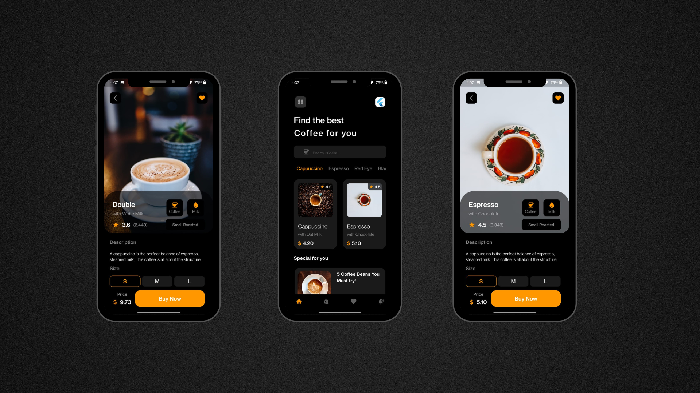

# coffee_shop - Flutter UI App

Presenting "Coffee" - a Flutter UI application that invites you to indulge in a delightful coffee adventure. Immerse yourself in the world of rich aroma and flavor as you browse through an exquisite selection of specialty coffees. With a user-friendly interface, exploring different blends and discovering their unique details becomes a delightful experience. From origin stories to brewing methods, the app provides a comprehensive insight into each coffee's distinctive character. The elegant UI design not only enhances the visual appeal but also ensures a seamless and enjoyable user interaction. Although focused on UI, "Coffee" symbolizes a passionate dedication to the art of coffee appreciation.

## Features

- **Exquisite Coffee Selection:** Explore a curated collection of specialty coffees from around the world, each with its unique flavor profile.

- **Rich Coffee Details:** Discover the origin, tasting notes, and brewing methods for each coffee, allowing you to make an informed choice.

- **User-friendly Interface:** The app's intuitive design ensures that both coffee enthusiasts and novices can navigate effortlessly.

- **Elegant UI Design:** Enjoy a visually appealing and aesthetically pleasing experience that complements the sophistication of coffee appreciation.

- **Seamless User Interaction:** The app is designed for smooth interactions, providing a delightful user experience.

## Screenshots

## Getting Started

To get started with the Coffee app, follow these steps:

1. **Prerequisites:** Ensure you have Flutter installed on your system. If not, you can install it from the official Flutter website.

2. **Clone the Repository:** Clone this repository to your local machine using the following command:

3. **Install Dependencies:** Navigate to the project directory and install the required dependencies:

4. **Run the App:** Now, you can run the app on your connected device or emulator:

Thank you for joining us on this delightful coffee adventure! We hope you enjoy exploring the world of specialty coffees with our app. Happy sipping! ☕️